<!--
  Black & White Terminal README  —  the whole README is terminal-themed.
  Files needed in your profile repo (named exactly like your GitHub username):
    1. README.md    (this file)
    2. terminal.svg (the black terminal panel — edit the [ ] text inside it)
  Pure monochrome: black background, white monospace + ASCII block title,
  with a live typewriter reveal + blinking cursor. Works in BOTH GitHub themes.
-->



```console
$ stats --theme=bw
```


<details>
<summary>text version (screen readers / no-images)</summary>

```
┌─────────────────────────────────────────────┐
│ ● ● ●  kcyb3r@github: ~                        │
└─────────────────────────────────────────────┘

$ whoami
  Kcyb3r  —  [YOUR ROLE]

$ cat about.txt
  [One or two lines about you.]

$ cat ./now.md
  [What you're currently working on / learning.]

$ ls ./stack
  languages : [Python, Go, TypeScript]
  frameworks: [React, Django]
  tooling   : [Docker, Git]

$ ./connect --help
  github : https://github.com/Kcyb3r
  email  : [you@example.com]

$ _█
```
</details>

<sub><code>// rendered in monochrome · no color, just contrast</code></sub>
